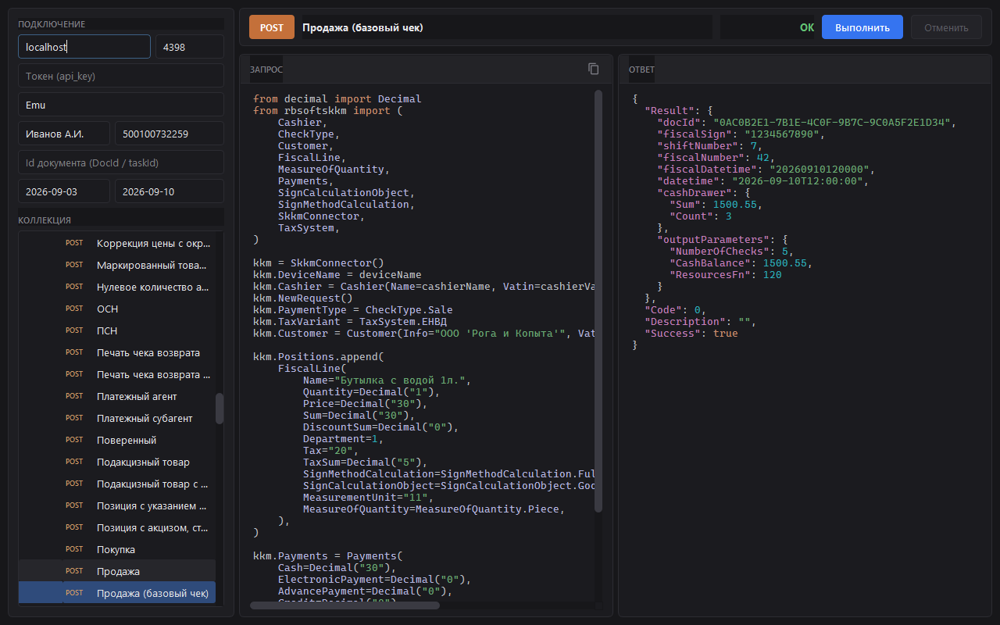
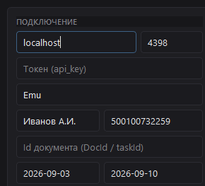

# Демо приложение коннектора для Сервера ККМ (Python)

Настольное приложение, которое показывает возможности библиотеки
[`rbsoftskkm`](README.md) вживую:
для каждого метода коннектора есть готовый пример - его **исходный код** видно на
экране, а **ответ сервера** приходит после нажатия «Выполнить».

По сути это интерактивный справочник: слева - дерево примеров по группам API,
справа - что именно отправляем в коннектор и что получаем от Сервера ККМ.



---

## Содержание

- [Возможности](#возможности)
- [Требования](#требования)
- [Запуск](#запуск)
- [Настройка подключения](#настройка-подключения)
- [Как устроены примеры](#как-устроены-примеры)
- [Добавить свой пример](#добавить-свой-пример)
- [Стек](#стек)
- [Лицензия](#лицензия)

---

## Возможности

- **Все группы REST API** — примеры разложены по дереву, повторяющему структуру
  Сервера ККМ: авторизация, администрирование (ККТ, служба), кассовые смены, отчёты,
  печать чеков, коррекции (ФФД 1.2 и 1.0.5), возвраты, наличные, нефискальные чеки
  (слипы, картинки, рекламные), маркировка, фискализация, очередь, шаблоны, операции.
- **Код запроса** — в панели «Запрос» показан реальный Python-код примера: как
  заполняются свойства `SkkmConnector` и какой метод вызывается (с подсветкой синтаксиса).
- **Подсказки по коду** — при наведении на имя метода, типа или поля всплывает его описание.
- **Ответ сервера** — в панели «Ответ» выводится результат вызова (JSON/поля).
- **Живой сервер** — примеры реально обращаются к Серверу ККМ по указанному адресу.
- **Отмена запроса** — кнопка «Отменить» активна, пока запрос выполняется; вызов
  завершается кодом `-3`, интерфейс не подвисает: запрос идёт в рабочем потоке.

---

## Требования

- **Python 3.10** и новее.
- **Запущенный Сервер ККМ** — адрес и порт службы печати (по умолчанию
  `localhost:4398`); для примеров подойдёт эмулятор ККТ.
- **Библиотека `rbsoftskkm`** и **PySide6** — устанавливаются одной командой
  (см. [Запуск](#запуск)).

---

## Запуск

1. Создайте окружение и поставьте зависимости:

```powershell
git clone https://github.com/mnrwa/SKKMConnectorPython.git
cd SKKMConnectorPython
python -m venv env
env\Scripts\activate
python -m pip install -e .[demo]
```

   Установка `-e .` берёт коннектор из каталога `src` — правки библиотеки видны сразу,
   а `[demo]` добавляет PySide6. Подробности — в [README коннектора](README.md).

2. Запустите приложение:

```powershell
python demo/program.py
```

   Либо как модуль: `python -m demo.program`.

3. Запустите Сервер ККМ, чтобы можно было к чему обращаться.

---

## Настройка подключения

В левой панели задаётся подключение — те же свойства, что у `SkkmConnector`.
Значения по умолчанию (подсказки в полях):



| Поле          | Пример           | Свойство коннектора                     |
| ------------- | ---------------- | --------------------------------------- |
| Хост          | `localhost`      | `Host`                                  |
| Порт          | `4398`           | `Port`                                  |
| Токен         | `api_key`        | `Token`                                 |
| Устройство    | `Emu`            | `DeviceName`                            |
| Кассир        | `Иванов А.И.`    | `Cashier.Name`                          |
| ИНН кассира   | `500100732259`   | `Cashier.Vatin`                         |
| Id документа  | -                | `DocumentId`                            |
| Период с / по | последние 7 дней | `ShiftsFrom` / `ShiftsTo` (для списков) |

Токен нужен, только если на сервере выключен анонимный доступ. `Ping` работает
и без него.

---

## Как устроены примеры

Все примеры лежат в пакете `demo/examples/` — по модулю на пример; место в дереве
задаётся не каталогом, а константой `GroupPath`.

При старте `example_host` сканирует пакет (`pkgutil.walk_packages` и `importlib`):
находит все классы-наследники `Sample` и сам собирает дерево — новый модуль
подхватывается без регистрации где-либо ещё.

В панели «Запрос» пример показывается как обычный клиентский код:

```python
from rbsoftskkm import SkkmConnector

kkm = SkkmConnector()
kkm.DeviceName = deviceName
# …
kkm.PrintCheck()
```

Каждый пример — класс-наследник `Sample` с константами пути/названия и одним
публичным методом, возвращающим `SkkmConnector` (префикс имени задаёт HTTP-метку
в дереве: `Get…` — GET, `Put…` — PUT, `Delete…` — DELETE, иначе POST):

```python
from decimal import Decimal

from demo.examples.sample import Sample
from rbsoftskkm import (
    Cashier,
    CheckType,
    FiscalLine,
    MeasureOfQuantity,
    Payments,
    SignCalculationObject,
    SignMethodCalculation,
    SkkmConnector,
    TaxSystem,
)


class CheckSample01(Sample):
    GroupPath = "Работа с ККМ|Печать чеков|Примеры чеков"
    Title = "Продажа (базовый чек)"

    def PostCheckSample01(self) -> SkkmConnector:
        kkm = self.kkm
        kkm.DeviceName = self.deviceName
        kkm.Cashier = Cashier(Name=self.cashierName, Vatin=self.cashierVatin)
        kkm.NewRequest()
        kkm.PaymentType = CheckType.Sale
        kkm.TaxVariant = TaxSystem.ЕНВД

        kkm.Positions.append(
            FiscalLine(
                Name="Бутылка с водой 1л.",
                Quantity=Decimal("1"),
                Price=Decimal("30"),
                Sum=Decimal("30"),
                Tax="20",
                SignMethodCalculation=SignMethodCalculation.FullPayment,
                SignCalculationObject=SignCalculationObject.Goods,
                MeasureOfQuantity=MeasureOfQuantity.Piece,
            )
        )

        kkm.Payments = Payments(Cash=Decimal("30"))

        kkm.PrintCheck()

        if not kkm.Ok:
            raise RuntimeError(kkm.ErrorDescription)

        return kkm
```

- **`GroupPath`** — путь в дереве слева (разделитель `|`).
- **`Title`** — название примера в дереве.
- **Метод** — заполняет свойства `SkkmConnector` (`kkm`) и вызывает метод коннектора;
  хост, порт, токен, касса и кассир подставляются из панели настроек через поля
  базового `Sample` (`deviceName`, `cashierName`, `cashierVatin`, `documentId`,
  `fromDate` / `toDate`).

Текст файла примера отображается в панели «Запрос»; результат вызова — в панели
«Ответ».

---

## Добавить свой пример

**В существующую группу** — создайте модуль в `demo/examples/`
(например, `demo/examples/my_x_report.py`) и добавьте класс:

```python
from demo.examples.sample import Sample
from rbsoftskkm import Cashier, SkkmConnector


class MyXReport(Sample):
    # Путь в дереве слева (разделитель |)
    GroupPath = "Работа с ККМ|Кассовые смены"
    # Название листа в дереве
    Title = "Мой X-отчёт"
    # Необязательно: порядок среди соседей (меньше — выше)
    SortOrder = 10

    # Префикс метода: Get… / Put… / Delete… / иначе POST
    def PostMyXReport(self) -> SkkmConnector:
        kkm = self.kkm
        kkm.DeviceName = self.deviceName
        kkm.Cashier = Cashier(Name=self.cashierName, Vatin=self.cashierVatin)

        kkm.ReportX()

        if not kkm.Ok:
            raise RuntimeError(kkm.ErrorDescription)

        return kkm
```

**Новая группа** — укажите новый путь в `GroupPath`; отдельный каталог заводить не нужно.
Порядок корневых узлов и известных групп можно подправить в `demo/ui/example_host.py`
(`ROOT_ORDER`, `KNOWN_ORDER`).

После сохранения файла:

1. Перезапустите приложение.
2. Пример появится в дереве сам — отдельная регистрация не нужна.
3. В панели «Запрос» будет виден исходный код этого файла, в «Ответ» — результат вызова.

Полное описание методов, полей и типов — в [API.md](API.md) и
[README коннектора](README.md).

---

## Стек

- **PySide6** — интерфейс: окно, дерево коллекции, подсветка кода и ответа (`QSyntaxHighlighter`),
  тёмная тема на QSS и палитре.
- **rbsoftskkm 1.27.0** — сам коннектор, ставится из каталога проекта.
- **Python 3.10+**.

## Лицензия

Распространяется свободно по лицензии **MIT** — см. [README коннектора](README.md).

**Разработчик:** Ершов Евгений / RBSoft · [rbsoft.ru](https://rbsoft.ru) ·
[online@rbsoft.ru](mailto:online@rbsoft.ru)
